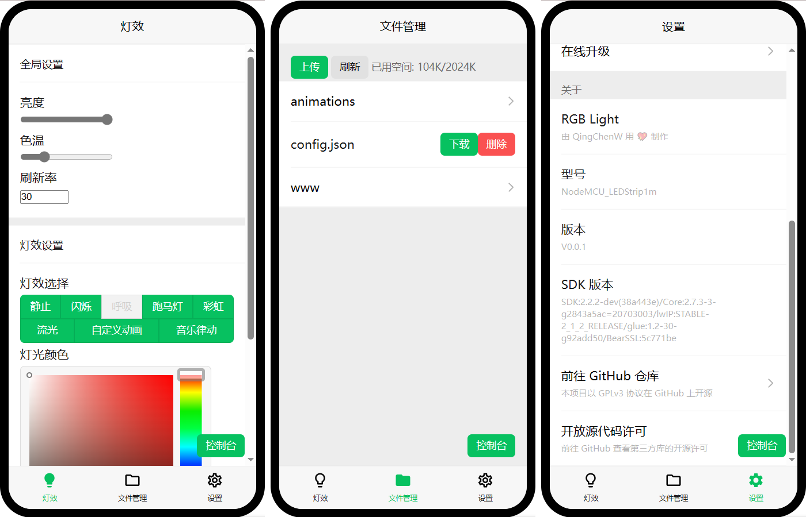
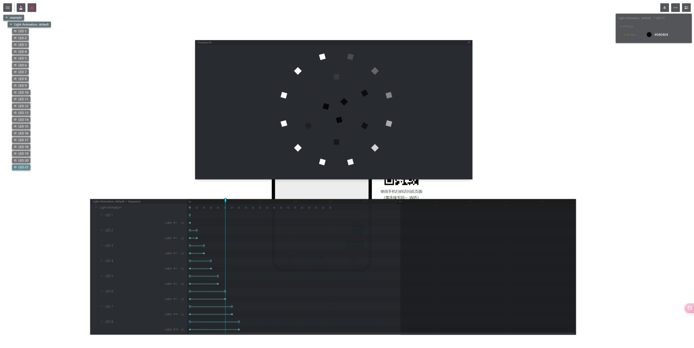

# RGB Light
# 炫酷 R! G! B! 灯

基于 ESP8266/ESP32/Raspberry Pi Pico 使用 Arduino 开发的物联网小彩灯, 支持多种形态多种光效, 支持自定义动画, 配套自研网页/小程序/PC 客户端, ~~并支持 HomeAssistant 等智能家居平台~~(TODO)

产品特色:
- 支持多种产品形态: 如灯带, 圆形灯盘, 方形灯板等, 提供简单易用的接口供用户自行适配 
- 支持多种光效模式: 如常亮, 闪烁, 呼吸, 流光, 彩虹, 音乐律动等, 参数均可自定义, 自由度高
- 支持音乐律动灯效: **非通过麦克风采集声音**, 而是通过配套上位机采集手机/电脑音频, 经上位机算法计算后将结果传输到下位机, 从而实现更好的音乐律动效果
- 支持自定义灯光动画: 可播放动画, 并通过网页动画编辑器编辑动画
- 多客户端支持: 配套自研网页/小程序/PC 客户端





## 所需硬件
### MCU
目前已在 ESP8266/ESP32/ESP32-C3/ESP32-S3/Raspberry Pi Pico W 上测试过, 理论上简单适配一下即可支持其他单片机

我使用的开发板为 WeMos D1 Mini, 使用 D4 脚连接 WS2812B

### 灯板
目前支持两种灯板:

一种为 1 米长的 WS2812B 灯带

另一种为自己画的 WS2812B 圆形灯板, 共有 21 颗灯珠, 整机最大电流 <1.5A, 原理图详见 pcb 目录

如果你想适配其他形态的灯板, 请参考下方教程

### 外壳
目前仅有投影灯形态的产品, 其模型位于 model 目录下

## 编译指南 (PlatformIO)
使用 PlatformIO 打开项目, 然后修改 config.h 中的配置, 选择对应的 Target 编译并烧录, 最后打包并上传文件系统

点击 Custom 中的 `Build Webpage` 目标可一键编译前端并拷贝至 data 目录 (需安装 Node.js 14 或以上版本), 点击 `Gen OTA Package` 目标可一键打包升级包到项目根目录下的 upgrade.bin (需安装 Python 3.8 或以上版本)

## 编译指南 (ArduinoIDE)
### 安装 Arduino 和第三方库
- [ESP8266-Arduino](https://github.com/esp8266/Arduino) (esp8266)
- [arduino-esp32](https://github.com/espressif/arduino-esp32) (esp32)
- [arduino-pico](https://github.com/earlephilhower/arduino-pico) (rp2040)
- [FastLED](https://github.com/FastLED/FastLED)
- [ArduinoJSON](https://github.com/bblanchon/ArduinoJson)
- [arduinoWebSockets](https://github.com/Links2004/arduinoWebSockets)

**注意**: 如果你在 ESP8266 上遇到了第一个灯会随机闪烁的问题, 请降级 ESP8266-Arduino 至 2.7.4 版本, FastLED 降级至 3.4.0 版本, 详见 [esp8266/Arduino#8054](https://github.com/esp8266/Arduino/issues/8054)

**注意**: 如果你在 ESP32-C3 上遇到了第一个灯不亮, 其余灯随机闪烁的问题, 请更新 FastLED 至 3.7.0 版本, 详见 [FastLED/FastLED#1349](https://github.com/FastLED/FastLED/issues/1349)

### 修改配置
根据您的需求修改 config.h 中的配置

### 编译前端网页 (可选)
预编译好的前端网页已位于 data/www 目录下, 如果你不需要修改前端网页, 则可以跳过这一步

如果修改了前端页面需要自己编译, 则首先需要安装 Node.js 14 或以上版本, 然后进入 web 目录并执行以下命令:

```sh
npm install
npm run build
```

编译后的网页会自动覆盖 data/www 目录

### 编译并烧录
除了需要烧录程序以外, 还需要上传 LittleFS 文件系统, 具体教程可参考 [Uploading files to file system](https://arduino-esp8266.readthedocs.io/en/stable/filesystem.html#uploading-files-to-file-system)

Arduino IDE 2.2.1+ 可使用此插件为 RP2040/ESP8266/ESP32 上传 LittleFS 文件系统: [arduino-littlefs-upload](https://github.com/earlephilhower/arduino-littlefs-upload)

### 打包升级包
ArduinoOTA 是支持在线升级文件系统的, 但是遗憾的是并不支持差量更新, 为了不丢失用户配置和自定义动画等数据, 我选择把 bin 和资源文件打包为单个二进制文件, 再由上位机进行解析更新

运行根目录下的 `pack_ota_bin.py` 即可打包升级包 (需要 Python 3.8 或以上版本), 生成的升级包位于 `./upgrade.bin`, 然后使用网页前端的`在线升级`功能即可升级

## 适配其他灯板
见 Light.hpp

## 新增灯效
见 LightEffect.hpp

## 音乐律动模式
在使用设备自带的网页端的音乐律动模式时, 若提示 `因浏览器策略限制无法启动音频采集` 时, 请前往[chrome://flags/#unsafely-treat-insecure-origin-as-secure](chrome://flags/#unsafely-treat-insecure-origin-as-secure) 将 `Insecure origins treated as secure` 设置为 `Enabled` 并添加设备网页 url 链接到列表中, 然后重启浏览器即可

## 自定义灯光动画
打开设备网页端, 进入文件管理页面, 再进入 animations 文件夹, 点击右下角的加号悬浮按钮即可新增动画, 点击动画文件上的编辑按钮即可编辑该动画

打开动画编辑器后, 点击左侧大纲中的任意元素即可打开序列窗口, 在序列窗口中可设置关键帧及过渡, 按下空格键可以预览动画, 制作完成后点击左上方保存按钮进行保存, 点击关闭按钮关闭动画编辑器

## 版权声明
本项目代码采用 GPLv3 协议开源, 允许商用, 但商用必须遵循 GPLv3 协议提供给客户完整源代码. 自制的灯板及外壳模型保留所有权利

动画编辑器来自于 [theatre-js/theatre](https://github.com/theatre-js/theatre), AGPLv3

本项目在开发的过程中也参考了一些其他项目, 在此一并致以感谢:
- [WLED](https://github.com/Aircoookie/WLED)
- [PlatformIO-Starter](https://github.com/FastLED/PlatformIO-Starter)

祝姐姐妹妹生日快乐!
